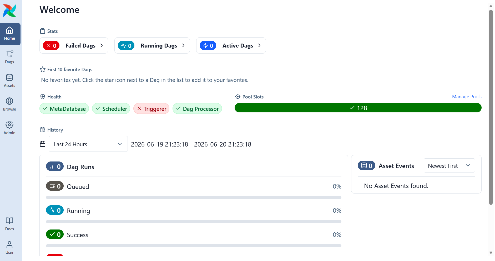

# TMDB Data Engineering Project
## Objective
### Build an end-to-end Data Engineering project using:
- TMDB API
- Python
- Airflow
- Databricks
- dbt
- Docker
- Star Schema Modeling
## Architecture
```text
TMDB API
    ↓
Airflow
    ↓
Python Extraction
    ↓
Databricks Bronze
    ↓
dbt Silver
    ↓
dbt Gold
    ↓
Analytics / Dashboard
```
## Milestone 1: Environment Setup
### Prerequisites 
#### Local Environment
- Windows 11 installed
- Docker Desktop installed
- VS Code installed
#### Cloud Environment
- Azure Databricks workspace available
- SQL Warehouse available
#### Databricks Setup:
- Create a catlog: tmdb_project
- Created Schemas: Bronze, silver, gold
- Collected Server hostname, http and personal access token from connection details and settings
#### TMDB setup
Created TMDB Developer Account

Generated:
- API Key
- Read Access Token
#### Project Structure

```text
tmdb_project
│
├── dags
├── dbt
├── include
├── logs
├── plugins
├── scripts
├── .env
└── .gitignore
```
## Milestone 2: Docker & Airflow Setup

1. Installed Docker Desktop and verified installation.
   - docker version
   - docker compose version
2. Created docker-compose.yml file.
3. Identified services required for LocalExecutor architecture:
   - PostgreSQL (Airflow Metadata Database)
   - Airflow Init
   - Airflow API Server
   - Airflow Scheduler
   - Airflow DAG Processor
4. Identified services not required for LocalExecutor:
   - Redis
   - Airflow Workers
5. Configured PostgreSQL service:
   - PostgreSQL 16
   - Database: airflow
   - User: airflow
   - Persistent Docker volume
   - Health checks
6. Configured Airflow common settings:
   - Airflow 3.1.3
   - LocalExecutor
   - Metadata database connection
   - Volume mappings for dags, logs, plugins, include, dbt and scripts
7. Configured Airflow services:
   - airflow-init
   - airflow-apiserver
   - airflow-scheduler
   - airflow-dag-processor
8. Created Docker volume:
   - postgres-db-volume
9. Validated docker-compose.yml:
   - docker compose config
10. Resolved Docker issues:
    - Docker Engine not running
    - PostgreSQL port conflict (5432 already allocated)
11. Successfully started containers:
    - docker compose up -d
12. Verified container status:
    - docker compose ps
13. Verified scheduler startup:
    - LocalExecutor loaded successfully
    - Scheduler started successfully
14. Accessed Airflow UI:
    - http://localhost:8080
15. Airflow 3 Simple Auth Manager generated an admin user automatically.
16. Databricks remains in Azure and is not deployed inside Docker.
```text
Docker Desktop
        │
        ├── PostgreSQL Container
        ├── Airflow API Server
        ├── Airflow Scheduler
        └── Airflow DAG Processor
                    │
                    ▼
              Airflow UI
           http://localhost:8080
```
Airflow will look likes below:


## Milestone 3 – TMDB API Ingestion with Airflow 
Build a Python-based ingestion pipeline to extract movie data from the TMDB API and orchestrate it using Apache Airflow.

### 1. TMDB API Setup
* Created TMDB developer account
* Generated API Read Access Token
* Stored token in `.env`
* Verified API connectivity
### 2. Python Extraction Script
Location:
scripts/tmdb/extract_popular_movies.py
* Read TMDB token from environment variable
* Call TMDB Popular Movies endpoint
* Validate API response
* Save raw response as JSON
Output:
include/raw/tmdb/popular_movies.json

### 3. Airflow DAG
DAG Name:
tmdb_ingestion
Task:
extract_popular_movies
* Execute extraction script
* Trigger TMDB API call
* Generate raw JSON file

### 4. Validation
* DAG executed successfully
* Task status = Success
* API returned HTTP 200
* JSON file created successfully
* Airflow orchestration verified

## Milestone 4 – Load Raw Data to PostgreSQL
Load extracted TMDB movie data from JSON into PostgreSQL raw layer.

- Created schema tmdb
- Created table raw_popular_movies
- Designed table structure based on TMDB API response
- Read JSON file from /include/raw/tmdb/popular_movies.json
- Parsed results array
- Inserted movie records into PostgreSQL
- Added primary key on movie_id
- Verified successful load in DBeaver
- Result:
  * Raw ingestion layer established
  * movie records loaded successfully
  * PostgreSQL ready for dbt transformations

## Milestone 5 – dbt Project Setup
* Installed dbt Core and dbt-postgres adapter
* Created dbt project: `tmdb_dbt`
* Configured `profiles.yml`
* Connected dbt to PostgreSQL
* Connected dbt to schema `tmdb`
* Successfully executed `dbt debug`
* Verified database connectivity

### Result
* dbt environment configured successfully
* PostgreSQL integration verified
* Ready to build transformation models

### Staging Layer
Created model:
`models/staging/stg_popular_movies.sql`
Transformations performed:
1. Renamed columns to business-friendly names
2. Standardized naming conventions
3. Selected only required columns
4. Performed basic data standardization
5. Established a clean staging layer for downstream transformations
Executed:
`dbt run --select stg_popular_movies`
Result:
* `tmdb.stg_popular_movies` created successfully in PostgreSQL

### Intermediate Layer
Apply business logic and reusable transformations before dimensional modeling.
Created model:
`models/intermediate/int_movies_clean.sql`
Transformations performed:
1. Extracted `release_year` from `release_date`
2. Created derived business columns:
   * `rating_category`
   * `popularity_category`
3. Prepared data for dimensional modeling
Executed:
`dbt run --select int_movies_clean`
Result:
* `tmdb.int_movies_clean` created successfully in PostgreSQL

### Mart Layer
Design analytical data models for reporting and dashboarding.
Created models:
* `dim_movie`
* `fact_movie_performance`
Implemented a Star Schema design:
Dimension Table:
* `dim_movie`
Fact Table:
* `fact_movie_performance`
Result:
* Analytical layer ready for reporting and dashboard development
* Business-friendly data model established

## Milestone 6 – Data Quality Testing
Prevent bad-quality data from reaching downstream systems.
### Primary Key Validation
Model:
`dim_movie`
Column:
`movie_id`
Tests applied:
* not_null
* unique
### Fact Table Validation
Model:
`fact_movie_performance`
Column:
`movie_id`
Test applied:
* not_null
### Relationship Test
Validated that:
`fact_movie_performance.movie_id`
exists in:
`dim_movie.movie_id`
This ensures referential integrity between fact and dimension tables.

### Test Execution
Executed: `dbt test`
Result:
* All tests passed successfully
* Data quality validated before downstream consumption
* Pipeline designed to fail if critical data quality checks fail

## Milestone 7 – Airflow Orchestration
Created DAG: `tmdb_ingestion.py`

Workflow:
```text 
extract_popular_movies
        ↓
load_popular_movies_to_postgres
        ↓
     dbt_run
        ↓
    dbt_test
```
### Airflow Tasks
1. Extract movie data from TMDB API
2. Load raw data into PostgreSQL
3. Execute dbt transformations
4. Execute dbt data quality tests
### DAG Execution
Triggered DAG manually from Airflow UI.
Result:
* extract_popular_movies → SUCCESS
* load_popular_movies_to_postgres → SUCCESS
* dbt_run → SUCCESS
* dbt_test → SUCCESS
### Outcome
Successfully orchestrated an end-to-end data pipeline using Airflow, PostgreSQL, Python, dbt, and Docker.

The pipeline automatically extracts, loads, transforms, validates, and prepares movie data for analytical consumption.

## Milestone 8 – Multi-Page API Ingestion
Increase data volume by extracting multiple pages from the TMDB API.
### Enhancements
* Modified extraction script to support pagination
* Implemented page-based looping using the TMDB page parameter
* Extracted the first 5 pages of popular movies from the TMDB API
* Combined movie records from all pages into a single JSON payload
* Preserved the existing JSON structure for downstream compatibility
* Increased raw dataset size for transformation and analytics
### Validation
* Airflow DAG executed successfully
* Movie data extracted from multiple API pages
* Data loaded successfully into PostgreSQL
* dbt models executed successfully
* dbt tests passed successfully
### Result
* Successfully ingested approximately 100 movie records from 5 TMDB API pages
* Established a scalable foundation for future incremental ingestion

## Milestone 9 – Incremental Loading and Audit Tracking
Implement incremental processing and data auditing capabilities.
### Enhancements
* Added `loaded_at` column to track the initial load timestamp
* Added `updated_at` column to track the latest update timestamp
* Added `ingestion_date` column to track the ingestion batch date
* Enhanced raw data loading logic using PostgreSQL UPSERT functionality
* Changed `ON CONFLICT DO NOTHING` to `ON CONFLICT DO UPDATE`
* Preserved original load timestamps while updating modified records
* Converted `fact_movie_performance` into a dbt Incremental Model
* Configured `movie_id` as the unique key for incremental processing
### Validation
* Existing movie records updated successfully
* New movie records inserted successfully
* Audit columns populated correctly
* Incremental model executed successfully
* dbt tests passed successfully
### Result
* Implemented production-style incremental loading
* Enabled tracking of record creation and update history
* Improved pipeline efficiency by processing only new or changed data

## Milestone 10 – Macros
- Created get_rating_category()
- Created get_popularity_category()
Replaced CASE statements with reusable macros

## Milestone 11 – Seeds
Created genre_mapping.csv
- Executed dbt seed
- Generated tmdb.genre_mapping

## Milestone 12 – Snapshots
Created raw_popular_movies_snapshot
- Executed dbt snapshot
- Verified SCD2 columns
## Milestone 13 – Airflow Scheduling, Retries and Notifications
Improve pipeline reliability and automate execution using production-ready Airflow features.
### Enhancements
* Configured DAG schedule to run automatically on a daily basis
* Enabled retry mechanism for transient failures
* Configured retry delay between execution attempts
* Implemented failure notification callback
* Enhanced operational monitoring through Airflow logs
* Maintained end-to-end orchestration of extraction, loading, transformation, and testing tasks
### Validation
* DAG parsed successfully in Airflow
* Scheduled DAG configuration verified
* Retry configuration applied successfully
* Failure callback function registered successfully
* Pipeline executed successfully from Airflow UI
* All tasks completed successfully:
  * extract_popular_movies
  * load_popular_movies_to_postgres
  * dbt_run
  * dbt_test
### Result
* Established production-style orchestration using Apache Airflow
* Improved pipeline resiliency through automatic retries
* Enabled failure monitoring and alerting capabilities
* Prepared the pipeline for automated daily execution
## Milestone 14 – Airflow XComs and Hooks
Improve Airflow task communication and database connection management.

### Enhancements
- Implemented XCom to pass metadata from extraction task to load task
- Passed JSON file path and source information through XCom
- Created Airflow PostgreSQL connection
- Implemented PostgresHook for database validation
- Validated raw movie and genre row counts using Airflow-managed connection
### Result
- Improved DAG communication between tasks
- Removed dependency on hardcoded validation connection logic
- Added production-style Airflow Hook usage
